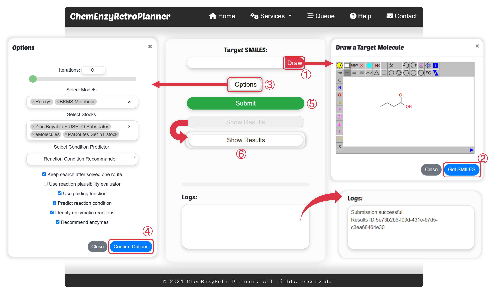
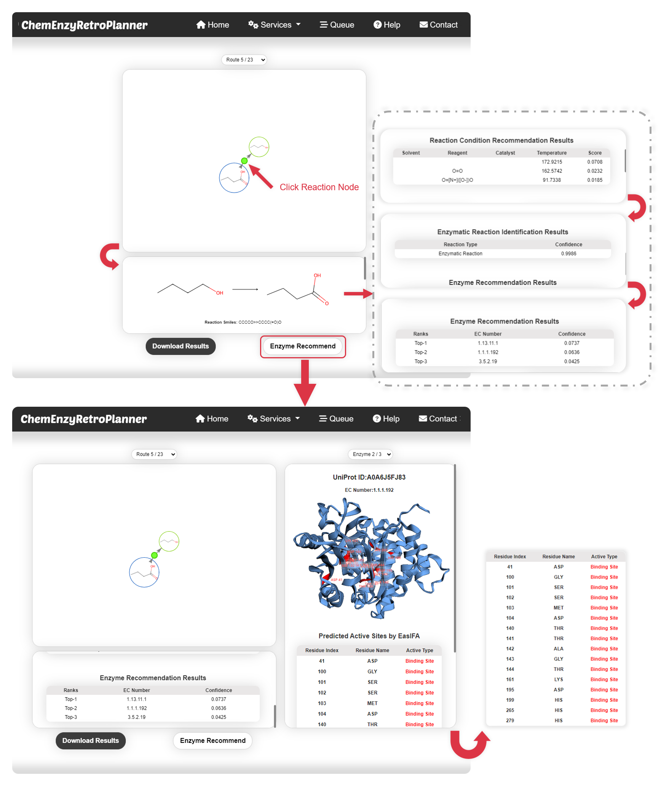
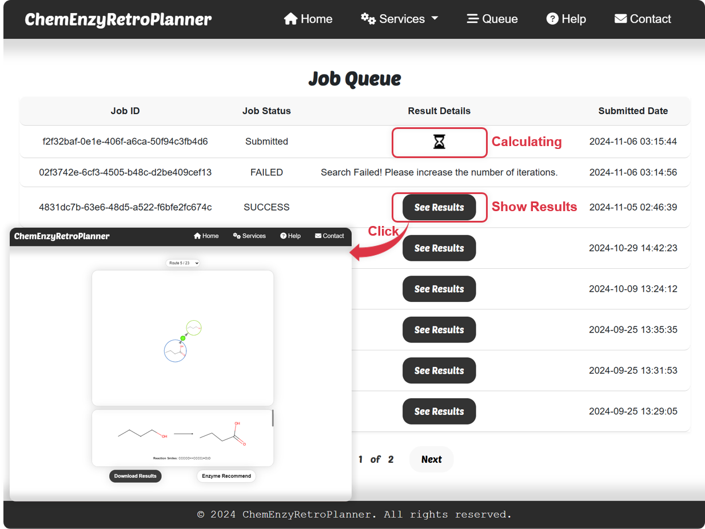

# ChemEnzyRetroPlanner
## Notice

The public server is currently under heavy load. For large or long-running jobs, please deploy locally and run computations on your own machine.
--
<div id="top" align="center">

  <h3>ChemEnzRretroPlanner: A Virtual Platform for Automated Hybrid Organic-Enzymatic Synthesis Planning</h3>
  
  [](https://github.com/wangxr0526/ChemEnzyRetroPlanner/stargazers)
  [](http://cadd.zju.edu.cn/retroplanner)
  
  <!-- [](https://zenodo.org/doi/10.5281/zenodo.12819439) -->

</div>


## Contents

- [ChemEnzyRetroPlanner](#chemenzyretroplanner)
  - [Contents](#contents)
  - [Publication](#publication)
  - [Web Server](#web-server)
  - [OS Requirements](#os-requirements)
  - [Python Dependencies](#python-dependencies)
  - [Installation Guide](#installation-guide)
  - [Demo Video](#demo-video)
  - [Agent Installation](#agent-installation)
  - [Related repository](#related-repository)
  - [Cite Us](#cite-us)
 

## Publication
[A Virtual Platform for Automated Hybrid Organic-Enzymatic Synthesis Planning](https://www.nature.com/articles/s41467-025-65898-3)

## Web Server

We have developed a [Web Server (primary domain)](http://cadd.zju.edu.cn/retroplanner) and a [mirror site (backup domain)](http://cadd.iddd.group/retroplanner/) for ChemEnzyRetroPlanner, which enables users to leverage our hybrid synthetic planning platform, integrating organic and enzymatic catalysis, to achieve more efficient and environmentally friendly synthesis planning.
<br>

<div id="top" align="center">



<h4>ChemEnzyRetroPlanner input interface</h4><br>



<h4>ChemEnzyRetroPlanner results interface</h4><br>



<h4>ChemEnzyRetroPlanner queue interface</h4><br>

</div>


## OS Requirements
This repository has been tested on **Linux**  operating systems.

## Python Dependencies
* Python (version >= 3.8)
* DGL (version 2.0.0, CUDA 12.1)
* Torch (version 2.1.2, CUDA 12.1)
* RDKit (version 2022.9.5)
* NumPy (version >= 1.23.5)
* Pandas (version 1.4.4)


## Installation Guide

It is recommended to use conda to manage the virtual environment.The installation method for conda can be found [here](https://conda.io/projects/conda/en/stable/user-guide/install/linux.html#installing-on-linux).<br>

```
git clone https://github.com/wangxr0526/ChemEnzyRetroPlanner.git
cd ChemEnzyRetroPlanner
chmod +x ./setup_ChemEnzyRetroPlanner.sh
./setup_ChemEnzyRetroPlanner.sh
```
Build the Parrot service image
```
cd ChemEnzyRetroPlanner/retro_planner/packages/parrot
chmod +x ./build_parrot_in_docker.sh
./build_parrot_in_docker.sh
```
Start ChemEnzyRetroPlanner services
```
cd ChemEnzyRetroPlanner/docker
chmod +x ./run_container.sh
./run_container.sh
```
The ChemEnzyRetroPlanner server is deployed at http://localhost:8001/retroplanner

## Demo Video

https://github.com/user-attachments/assets/0187adc8-2015-4b38-862c-c461292cbdff

## Agent Installation
```
git clone https://github.com/wangxr0526/ChemEnzyRetroPlanner_agent.git
cd ChemEnzyRetroPlanner_agent
conda env create -f envs.yml
conda activate retro_planner_agent_env
pip install chemprice
pip install -e ./agent
cd ../streamlit_app
streamlit run app.py
```
## Related repository
[ChemEnzyRetroPlanner Agent](https://github.com/wangxr0526/ChemEnzyRetroPlanner_agent.git)
## Cite Us

```bibtex
@article{wang_chemenzyretroplanner_2025,
      title = {A virtual platform for automated hybrid organic-enzymatic synthesis planning},
      volume = {16},
      number = {1},
      issn = {2041-1723},
      url = {https://www.nature.com/articles/s41467-025-65898-3},
      doi = {10.1038/s41467-025-65898-3},
      journal = {Nature Communications},
      author = {Wang, Xiaorui and Yin, Xiaodan and Zhang, Xujun and Zhao, Huifeng and Gu, Shukai and Wu, Zhenxing and Zhang, Odin and Qian, Wenjia and Huang, Yuansheng and Li, Yuquan and Jiang, Dejun and Wang, Mingyang and Liu, Huanxiang and Yao, Xiaojun and Hsieh, Chang-Yu and Hou, Tingjun},
      month = {November},
      year = {2025},
      pages = {10929},
}
```
